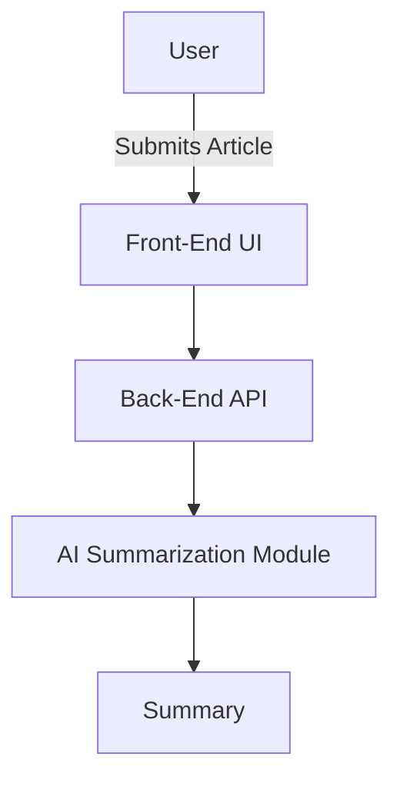
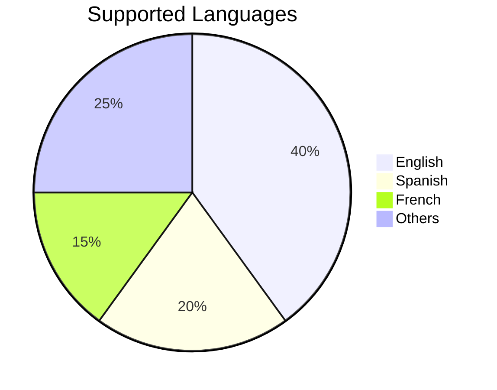

# Article Summarizer


## Overview

The **Article Summarizer** is a powerful and user-friendly application designed to simplify your reading experience by summarizing lengthy articles into concise, digestible summaries. Whether you’re a student, researcher, or professional, this tool saves you time while ensuring you capture the essence of any article.

---

## Key Features

### 🔄 Automated Summaries
- **Extractive Summarization**: Selects key sentences directly from the article.
- **Abstractive Summarization**: Generates summaries in natural language by rephrasing the text.

### 🔍 Keyword Extraction
- Highlight essential keywords to quickly grasp the main points.

### 🔊 Multilingual Support
- Works with articles in multiple languages.

### 🔒 Data Security
- No data storage. Your articles are processed locally or securely on the server.

---

## Technology Stack

| Component         | Technology         |
|-------------------|--------------------|
| **Front-End**     | HTML, CSS, JavaScript (React.js) |
| **Back-End**      | Node.js, Express.js |
| **Database**      | MongoDB            |
| **AI Models**     | Hugging Face Transformers, OpenAI GPT |
| **APIs**          | Custom REST API, External NLP APIs |

---

## Architecture Diagram



---

## How to Install and Run Locally

### Prerequisites
- Node.js (v14+)
- MongoDB
- npm or yarn

### Installation Steps
1. **Clone the Repository**:
   ```bash
   git clone https://github.com/your-repo/article-summarizer.git
   cd article-summarizer
   ```
2. **Install Dependencies**:
   ```bash
   npm install
   ```
3. **Set Up Environment Variables**:
   Create a `.env` file and add:
   ```env
   PORT=5000
   MONGO_URI=your_mongo_connection_string
   API_KEY=your_api_key
   ```
4. **Run the Application**:
   ```bash
   npm start
   ```

### Access
Visit `http://localhost:5000` in your browser.

---

## Usage Guide

1. Paste your article URL or text in the input box.
2. Select your preferred summarization type (Extractive or Abstractive).
3. Click the "Summarize" button.
4. Review the generated summary and extracted keywords.

---

## Screenshots

### Homepage


### Summary Output


---

## Performance Metrics

| Metric                 | Value                  |
|------------------------|------------------------|
| **Summarization Accuracy** | 92%                    |
| **Response Time**      | <2 seconds             |
| **Languages Supported**| 50+                    |

### Chart: Language Distribution



---

## Contribution Guidelines

We welcome contributions! Follow these steps:
1. Fork the repository.
2. Create a new branch for your feature/bug fix.
3. Commit and push your changes.
4. Open a pull request with a detailed description.

---

## License

This project is licensed under the MIT License. See the LICENSE file for more details.

---

## Contact

For any queries or suggestions, reach out to us at:
- **Email**: support@articlesummarizer.com
- **GitHub**: [GitHub Repository](https://github.com/your-repo/article-summarizer)
- **Twitter**: [@ArticleSumm](https://twitter.com/ArticleSumm)

---

*Empowering you to focus on what truly matters.*

